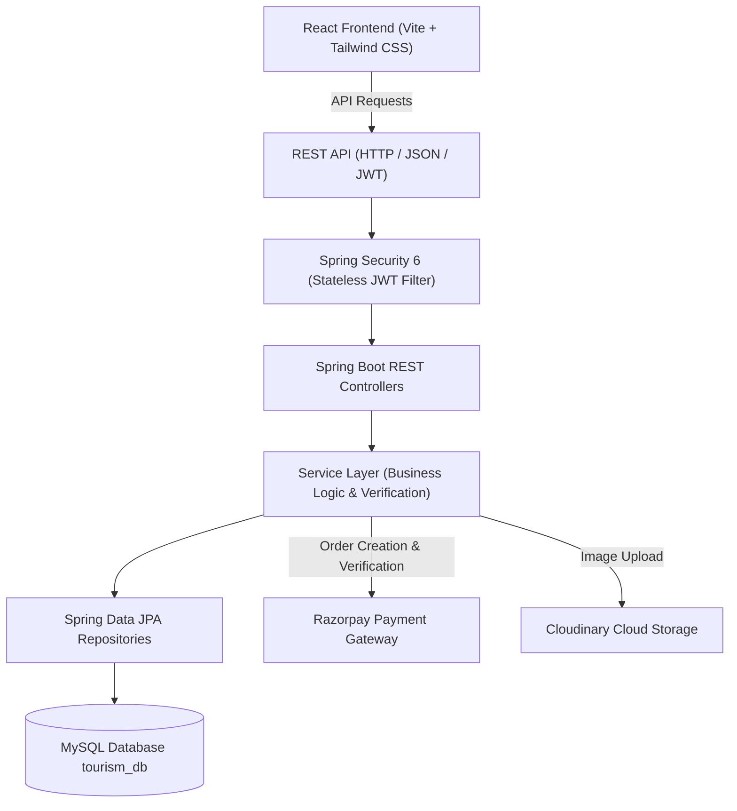
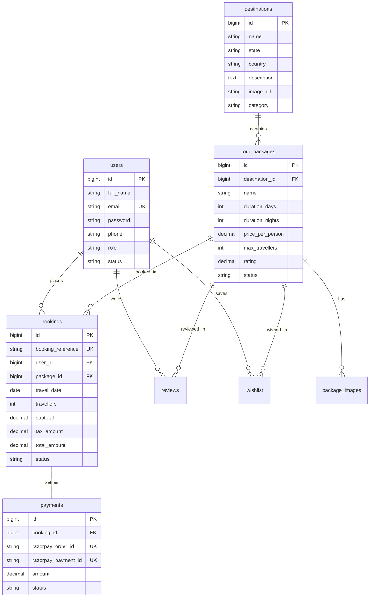
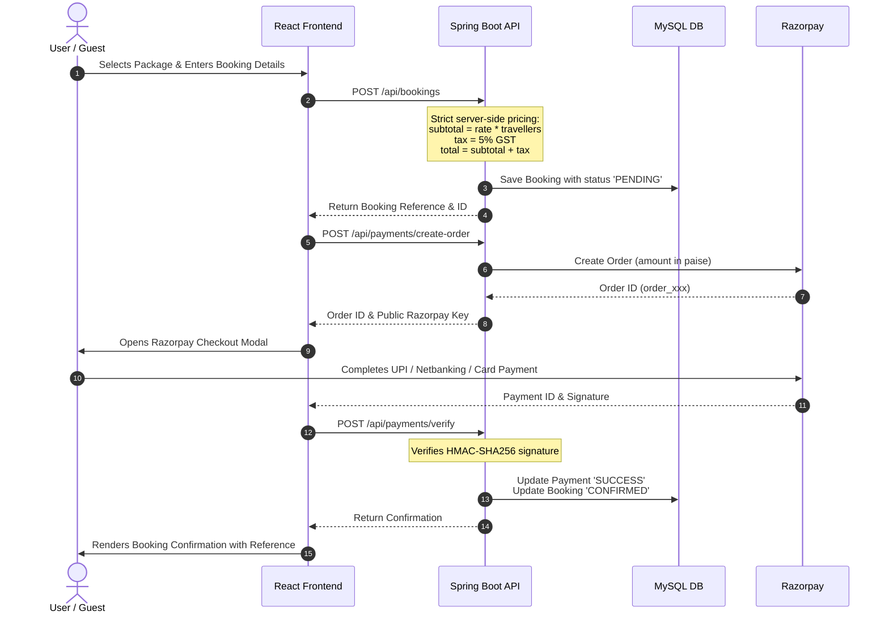

# TravelGo — Project Architecture & Execution Flow

This document details the system architecture, entity relationships, and core workflow lifecycles for the **TravelGo** platform.

---

## 1. System Architecture

---

## 2. Entity-Relationship Diagram

---

## 3. Booking & Razorpay Payment Flow

